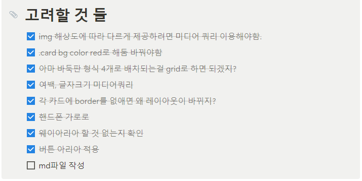
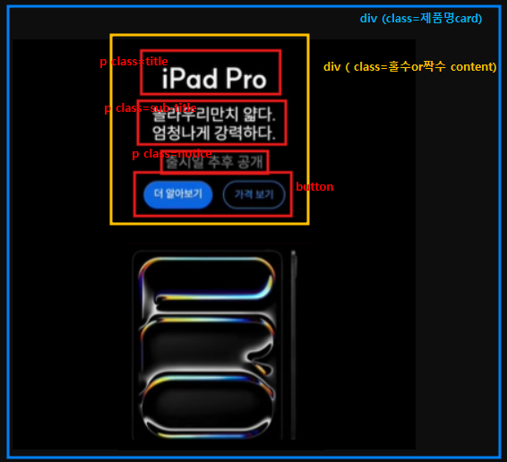
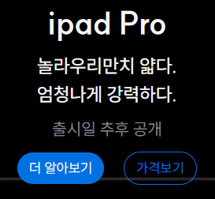
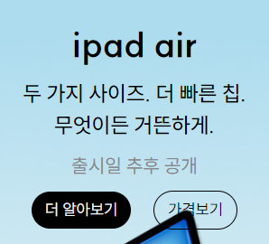

# 🚩03-APPLE 과제 수행

### [🔗완성된 링크](https://bomellen.github.io/homework/apple/apple.html)

---

## ✅ 프로젝트 주제 및 구성

이번 과제의 주요 요구사항은 아래와 같다.

- **_`CSS Grid`_** 를 사용하여 **반응형 레이아웃**을 구현한다.

- 중단점(breakpoint)은 **`1024px`** 로 지정한다. &rightarrow; (Small Screen - 1024px 이하 / Large Screen - 1024px 이상)
- Apple 제품 이미지는 \ 요소가 아닌 CSS의 background 속성을 활용하여 구현한다.
  이 때 디바이스의 `픽셀 밀도`에 따라 1배율 또는 2배율 이미지가 배경으로 반영되도록 한다.
- **`theme.css`** 파일에 제공 된 값(색상, 텍스트 크기, 여백 등)을 사용한다.

  </br>


위는 이번 과제를 하며 고려한 사항들이다.

</br>

## ✅마크업 설명



```html
<div class="ipad-air-card">
   <div class="even-content">
     <p class="title">ipad air</p>
     <p class="sub-title">두 가지 사이즈. 더 빠른 칩. </br>무엇이든 거뜬하게.</p>
     <p class="notice">출시일 추후 공개</p>
     <button type="button" class="full-color-button-black" aria-label="아이패드 에어 더 알아보기">더 알아보기</button>
     <button type="button" class="empty-color-button-black" aria-label="아이패드 에어 가격보기">가격보기</button>
   </div>
```

⬆️ 컴포넌트 예시

---

</br>

### [div] 제품명-card

우선 조건 중 하나가 배경 이미지를 css의 `background-image` 속성을 이용하는 것 이었기 때문에 각 제품별로 배경이 달라지기 때문에 독립된 class를 가져야했다. 그래서 `제품명-card class`를 컴포넌트를 만들게 되었다.

### [div] 홀수or짝수-content

 &nbsp;&nbsp; 
사이트를 보다보면 홀수는 흰 글씨에 파란 버튼, 짝수는 검정 글씨에 검정 버튼으로 통일되어 있었기 때문에 홀수와 짝수 두개의 컴포넌트를 만들어, 순서에 맞게 적용시켜주었다.
</br>
그리고 내부의 컨텐츠들은 \<p> 태그의 `title`, `sub-title`, `notice` \<button> 태그의 `button` 으로 마크업 해주었다. 그러고 홀수 , 짝수에 따라 색상만 다르게 적용해주었다.

---

</br>

## ✅ 스타일링 설명

### 카드 레이아웃

```css
.ipad-pro-card {
  border: 0.0001px solid;
  color: var(--white);
  width: 100%;
  height: var(--size);
  margin-bottom: 0.9375rem;
  background: url(./../products/ipad_pro.jpeg) no-repeat center;
  background-size: cover;
}
```

카드 요소는 위와 같이 스타일링 하였다. 제품에 따라 class를 생성하고, 배경을 위 코드에서 이미지의 주소만 바꿔주었는데, 그러다보니 제품마다 중복되는 코드가 많아서 이를 간단하게 개선할 수 있는 방법이 있으면 좋겠다는 생각을 했다.

컬러와 간격들은 모두 제공된 변수를 theme에서 가져와 사용하였다.

### 버튼


버튼은 큰 스타일링은 없지만 호버와 커서 효과를 주어서 포커싱 되었을 때 구분이 쉽도록 하였다.

```html
<button type="button" class="full-color-button-black" aria-label="아이폰 15 더 알아보기">더 알아보기</button> <button type="button" class="empty-color-button-black" aria-label="아이폰 15 가격보기">가격보기</button>
```

또한 위와같이 접근성을 위해 타입 지정과 aria-lable 코드를 추가하였다.

### 홀수or짝수 title

- 홀수 스타일링

```css
.odd-content {
  gap: var(--small-spacing);
  padding-top: var(--large-spacing);

  text-align: center;
  .title {
    font-size: var(--large-text);
    font-weight: 700;
  }
  .sub-title {
    font-size: var(--base-text);
    margin-block: var(--small-spacing);
    line-height: var(--line-normal);
    font-weight: 500;
  }
  .notice {
    font-size: var(--small-text);
    color: var(--gray);
    margin-block: var(--small-spacing);
  }
  .full-color-button-blue {
    margin-right: var(--base-spacing);
    background-color: var(--blue-300);
    color: var(--white);
  }
  .empty-color-button-blue {
    background-color: transparent;
    border: 1px solid var(--blue-300);
    color: var(--blue-300);
  }
  .full-color-button-black {
    margin-right: var(--base-spacing);
    background-color: var(--black);
    color: var(--white);
  }
  .empty-color-button-black {
    background-color: transparent;
    border: 1px solid var(--black);
    color: var(--black);
  }
}
```

- 짝수 스타일링

```css
.even-content {
  gap: var(--small-spacing);
  color: var(--black);
  padding-top: var(--large-spacing);

  text-align: center;
  .title {
    font-size: var(--large-text);
    font-weight: 700;
  }
  .sub-title {
    font-size: var(--base-text);
    margin-block: var(--small-spacing);
    line-height: var(--line-normal);
    font-weight: 500;
  }
  .notice {
    font-size: var(--small-text);
    color: var(--gray);
    margin-block: var(--small-spacing);
  }
  .full-color-button-blue {
    margin-right: var(--base-spacing);
    background-color: var(--blue-300);
    color: var(--white);
  }
  .empty-color-button-blue {
    background-color: transparent;
    border: 1px solid var(--blue-300);
    color: var(--blue-300);
  }
  .full-color-button-black {
    margin-right: var(--base-spacing);
    background-color: var(--black);
    color: var(--white);
  }
  .empty-color-button-black {
    background-color: transparent;
    border: 1px solid var(--black);
    color: var(--black);
  }
}
```

위 마크업 구조를 설명할 때 말 했던 것 처럼 홀수번째 컨텐츠와 짝수번째 컨텐츠의 기본 색상이 다르기 때문에 분리하여 작성해주었다.

## ✅ 미디어쿼리

이번 과제에서는 미디어쿼리를 이용해야하는 것이 많았다.

### 화면 사이즈에 따른 미디어 쿼리

이번 과제에서 화면 사이즈에 따라 다르게 해야하는 요소는 다음과 같았다.

- 일부 배경 이미지
- 일부 card의 gird 배치
- 일부 타이틀 글자 크기와 공백

여기서 grid 배치를 중요하게 보자면, 시안에서 마지막 네개의 요소가 1024px 이상의 화면일 땐 2\*2배열로 배치가 되었고, 화면이 좁아지면 한 줄로 배치가 되었다.

그래서 아래의 네 요소를 `wide-screen-grid` class로 한번 랩핑을 한 후 미디어 쿼리 코드 내에

```css
.wide-screen-grid {
  display: grid;
  grid-template-columns: repeat(2, 1fr);
  column-gap: 1rem;
  row-gap: 0.4rem;
}
```

다음과 같이 그리드 배치를 해주었다.


<구현 결과>

</br>

시안 중 일부 배경 이미지가 화면의 크기에 따라 달라지는 것은 다음과 같이 구현하였다.


### 사용자 기기 해상도에 따른 이미지 미디어쿼리

다음 미디어쿼리는 사용자의 디스플레이 해상도에 따라 고해상도의 이미지를 제공해주는 미디어쿼리이다. 이는 다음과 같이 웹킷 기반과 나머지의 브라우저를 모두 고려하여 조건을 주었고, 이미지를 고해상도 이미지로 제공하였다.

```css
@media (-webkit-min-device-pixel-ratio: 2), (min-resolution: 192dpi) {
  .ipad-pro-card {
    background-image: url(./../products/ipad_pro_2x.jpeg);
  }
  .ipad-air-card {
    background-image: url(./../products/ipad_air_2x.jpeg);
  }
  .iphone-15-pro-card {
    background-image: url(./../products/iphone15_pro_2x.jpeg);
  }
  .iphone-15-card {
    background-image: url(./../products/iphone15_2x.jpeg);
  }
  .watch {
    background-image: url(./../products/apple_watch_2x.jpeg);
  }
  .macbook-air {
    background-image: url(./../products/macbook_air_2x.jpeg);
  }
  .airpods-pro {
    background-image: url(./../products/airpods_pro_2x.jpeg);
  }
}
```

### 화면 사이즈와 해상도를 모두 고려한 미디어쿼리

제공해주신 이미지 중 wide 화면 사이즈일 때 달라지는 고해상도 이미지도 첨부해주셔서 둘 다 고려한 미디어쿼리도 작성하였다.

```css
@media (-webkit-min-device-pixel-ratio: 2) and (min-width: 1024px), (min-resolution: 192dpi) and (min-width: 1024px) {
  .ipad-air-card {
    background-image: url(./../products/ipad_air_wide_2x.jpeg);
  }
  .ipad-pro-card {
    background-image: url(./../products/ipad_pro_wide_2x.jpeg);
  }
  .iphone-15-pro-card {
    background-image: url(./../products/iphone15_pro_wide_2x.jpeg);
  }
}
```

## ✅ 느낀점

이번 기회를 통해 시안을 보며 사이트를 만들어 내는 것에 즐거움을 느꼈고, 마크업 하는 것을 배운 것을 생각하며 구성하는 것이 즐거웠다. 확실히 수업을 듣기 전 보다 성장했음을 느껴서 뿌듯했으나, 아직 부족한 점도 많이 느껴진다ㅎㅎ 그래도 좋은 점은 궁금한게 생기면 일단은 고민하고, 그 후 자료를 찾을 땐 mdn 공식 문서를 많이 참고하는 습관이 생겼다는 것 이다.

그리고 이번 기회를 통해 grid를 사용해본 것 도 좋았고, 많은 미디어쿼리 작성법을 생각해 볼 수 있는 과제라서 좋았다.

이번 코드에서 좀 중복되는 코드가 많은 것 같아서 컴포넌트를 좀 더 다르게 구성했으면 중복 되는 코드가 적었을 것 같다는 아쉬움이 든다.
