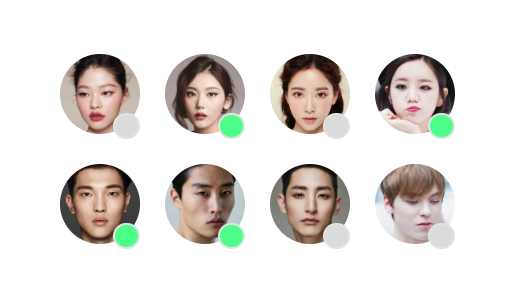

# 🚩02-Avatars 과제 수행

<br/>

## [ 프로젝트 주제 및 구성 ]

해당 과제는 주어진 레퍼런스를 아래와 같은 조건에 따라 구현하였다.

- 아바타 이미지는 배경 방식이 아닌 `콘텐츠 이미지`(\ 요소)로 마크업한다.
- 이미지 `성능 최적화` 방법에 대해 고민해본다.
- 아바타의 `상태 정보`를 알 수 있도록 정보를 제공한다.
- 가능한 flex 레이아웃이 아닌 float 레이아웃을 사용하기.
- 아바타 이미지의 크기 - 64px X 64px
- 아바타 이미지 간의 간격 - 20px
- 회색 원 배경색 - #DBDBDB
- 초록색 원 배경색- #4CFE88

<br/>

### ✅ \ 요소로 마크업

```html

```

이미지는 css에서 배경 방식으로 삽입하는 것이 아닌 `img` 태그를 이용하여 html에 삽입하였다.
<br/>

### ✅ 이미지 성능 최적화

```html
<picture>
  <source srcset="./../assets/avatars/face1.webp" type="image/webp" />
  
  <div class="circle" aria-label="모델 김아현, 비활성화 상태"></div>
</picture>
```

이미지 성능 최적화를 생각해보았을 때, 제공하는 이미지의 크기를 줄이는 방법이 적합할 것 같다고
생각했다.

다만, `jpg`이미지 자체의 크기를 줄여서 용량이 작아진 jpg만을 제공할 수 있지만 그 것 보다는
`webp` 확장자의 이미지를 제공하고 사용자의 브라우저가 `webp`포멧을 지원하지 않는다면 그 때 `jpg`를
보여주게끔 하는게 좋을 것 같다고 생각하여 위와 같은 코드로 작성하였다.

`webp`이미지는 같은 품질의 이미지를 `jpg`보다 더 작은 크기로 압축할 수 있기 때문에 `webp`포멧을 지원하는
브라우저를 활용하는 사용자라면 더 빠른 로딩 속도를 경험할 수 있기 때문이다.
<br/>

### ✅ 아바타의 '상태 정보' 제공하기

{: width="400px"}
레퍼런스는 위와 같이 우측 하단에 원형의 아이콘에 색깔로 상태 정보를 제공하고 있다.
초록색은 활성화 상태, 회색은 비 활성화 상태.
하지만 저렇게 이미지로만 된 정보는 접근성측면에서 좋지 않기 때문에 아래와 같이 코드를 작성하였다.

```html
<picture>
  <source srcset="./../assets/avatars/face1.webp" type="image/webp" />
  
  <div class="circle" aria-label="모델 김아현, 비활성화 상태"></div>
</picture>
```

`aria-label`을 활용하여 활성화 여부를 스크린 리더에서 읽을 수 있도록 하였다.
(이 부분은 모든 이미지에 각각 활성화 여부를 적어줘야하기 때문에 귀찮고 반복된 작업이라 더 좋게 수정하는 방법이 있을 것 같다.)
<br/>

### ✅ flex 레이아웃과 float 레이아웃

이번 과제에서 최대한 float 레이아웃을 써보려고 하였으나 정말 익숙치 않아서 일단 flex 레이아웃을 이용했다.
<br/>

### ✅ 느낀점

이번 부트 캠프를 들으면서 사실상 수업에서 들은 내용으로 코드를 짜는건 처음이었는데 지금까지 들은 내용을 활용하여 코드를 작성하려고 하니 머리가 터질 것 같았다ㅋㅋㅋ 왜냐하면 지금까지는 코드를 작성하면서 접근성과 seo를 고려하면서 코드를 작성한 적이 없었기 때문....!

이번 예제는 예전의 내가 코드를 짜던 대로 짠다면 금방 완성 되었을 수도 있지만 **접근성 생각하기, seo 생각하기, 시맨틱한 코드 작성하기, way-aria 활용해보기** 이 네가지를 잘 지켜 작성하고 싶었기 때문에 좀 오래 걸렸고 익숙치 않았다.

특히 원래 난 html 코드를 작성하기 전에 손으로 구조를 그려놓고 옮기는 편인데, 손으로 구조를 그리려고 하니.... 내가 div를 진짜 남발하고 있었다는 생각이...들었다. div를 최대한 안 쓰려고 노력하는 과정이 가장 힘들었다. 사실 이번 과제가 '시맨틱한 코드로 잘 작성 되었나? 더 시맨틱 하게 작성할 수 있었으려나?' 하는 생각이 많이 들어서 얼른 피드백을 받아보고싶다.

그리고 레이아웃... 과제를 내주신 의도대로 float로 꼭 만들어보고싶었는데 정말 익숙치 않아서 꽤 오랜시간이 걸릴 것 같아서 시도하지 못했다.. 평소대로였으면 꼭 해봤을텐데 마감 기한이 토요일 밤..인데 토요일에 약속이 있어서 수업이 끝나고 새벽까지 시도하였으나 역부족이어서 아쉬웠다. 다른 동료들의 float 레이아웃 형식을 얼른 보고싶다.

아 그리고 생각보다 '사용자에게 좋은 코드는 꽤나 복잡하구나'를 느꼈다. 접근성을 위해 작성하는 코드들이 꽤 많은데 사실 이전에는 이런것을 고려하지 않다보니 코드가 간결했는데 지금은 꽤 복잡해졌다. 하지만 사용자는 코드를 보는 것이 아닌 UI를 보는 것이기 때문에 '개발자가 좀 더 귀찮아야 사용자가 좀 더 편해지는 것 이구나' 라는 생각을 했다.
